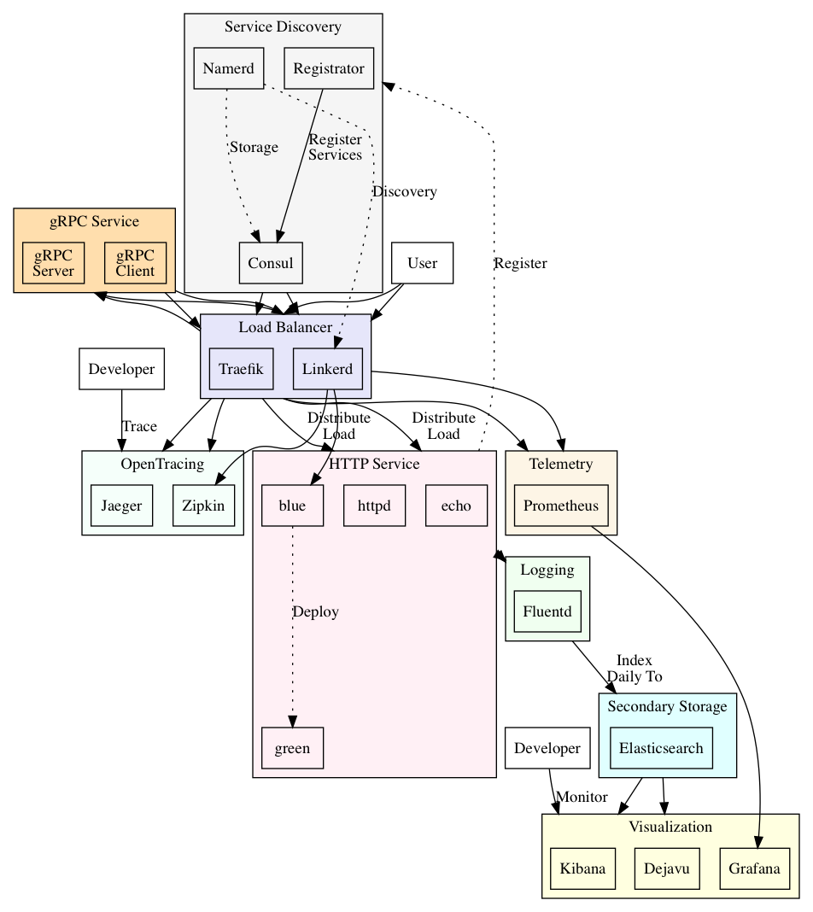

# Go Microservice Architecture

Sample architecture with Go, showing how the different pieces are tied together.

## Architecture



TODO: Cleanup the diagram, and add more services


## Abstract

The following architecture aims to solve several problems

- [x] Load balancing between services
- [x] Service discovery and registration
- [x] Resiliency patterns such as circuit breaker, timeout, retries
- [x] Centralized logging
- [x] Health checks for services
- [x] Telemetry metrics collection and dashboards
- [x] blue/green deployment (traffic splitting), rolling upgrades
- [ ] gRPC load balancing and discovery
- [x] open tracing capabilities
- [x] demonstrates the delegation of several capabilities to the infra, rather than repeating it at the code levels

## Start

```bash
$ docker-compose up -d
```

## UI

- consul: [localhost:8500](http://localhost:8500)
- traefik: [localhost:8080](http://localhost:8080)
- jaeger: [localhost:16686](http://localhost:16686)
- prometheus: [localhost:9090](http://localhost:9090)
- grafana: [localhost:3000](http://localhost:3000)
- linkerd: [localhost:9990](http://localhost:9990)
- namerd: [localhost:9991](http://localhost:9991)
- elasticsearch: [localhost:9200](http://localhost:9200)
- kibana: [localhost:9200](http://localhost:5601)
- dejavu: [localhost:1358](http://localhost:1358)

## Call the Echo Service

Scale the service:

```bash
$ docker-compose up -d --scale node=10
```

```bash
$ repeat 10; curl -H "Host: echo.consul.localhost" localhost:80 && printf "\n";
```

Output:

```bash
{"hostname":"e7d4b1cc317c","text":"hello"}
{"hostname":"0bdb052e096a","text":"hello"}
{"hostname":"62fa842dcf9c","text":"hello"}
{"hostname":"2e7f8dcbbc43","text":"hello"}
{"hostname":"1a59218e8121","text":"hello"}
{"hostname":"bee0e7437024","text":"hello"}
{"hostname":"547af30289ee","text":"hello"}
{"hostname":"fec9b78a7e7c","text":"hello"}
{"hostname":"a27f75db0290","text":"hello"}
{"hostname":"5a9726496329","text":"hello"}
```

## Calling Linkerd

In `linkerd.yaml`, we set it to listen to consul for changes and register the services there. We expose the port `:4040` as the load balancer ingress, and set the identifier to `io.l5d.header.token`. To call the echo service:

```bash
$ curl -H "Host: echo" localhost:4140
```

## Setup Namerd

### Creating Egress

```bash
$ curl -v -XPUT -d @config/namerd.egress.dtab -H "Content-Type: application/dtab" http://localhost:4180/api/1/dtabs/consul_egress
```

Output:

```bash
*   Trying ::1...
* TCP_NODELAY set
* Connected to localhost (::1) port 4180 (#0)
> PUT /api/1/dtabs/consul_egress HTTP/1.1
> Host: localhost:4180
> User-Agent: curl/7.54.0
> Accept: */*
> Content-Type: application/dtab
> Content-Length: 34
>
* upload completely sent off: 34 out of 34 bytes
< HTTP/1.1 204 No Content
<
* Connection #0 to host localhost left intact
```


### Creating Ingress

```bash
$ curl -v -XPUT -d @config/namerd.ingress.dtab -H "Content-Type: application/dtab" http://localhost:4180/api/1/dtabs/consul_ingress
```

Output:

```bash
*   Trying ::1...
* TCP_NODELAY set
* Connected to localhost (::1) port 4180 (#0)
> PUT /api/1/dtabs/consul_ingress HTTP/1.1
> Host: localhost:4180
> User-Agent: curl/7.54.0
> Accept: */*
> Content-Type: application/dtab
> Content-Length: 35
>
* upload completely sent off: 35 out of 35 bytes
< HTTP/1.1 204 No Content
<
* Connection #0 to host localhost left intact
```

## Make Call to Linkerd

```bash
$ curl -H "Host: echo" localhost:4140
```

## To simulate running traffic

```bash
# To simulate running traffic, runs for 120s
$ wrk -c1 -d120 -t1  -H "Host: echo" http://localhost:4140
```

## Check Dtabs

```bash
$ curl http://localhost:4180/api/1/dtabs/consul_ingress
```
<!--
This code shows how to distribute traffic in linkerd, particularly useful for blue/green deployment. One-tenth of the traffic will be sent to api2 and the rest to api1. api2 is the newer version that needs to be released.

/svc      => /#/io.l5d.linker_to_consul/.local;
/svc/api1 => 1 * /#/io.l5d.linker_to_consul/.local/api2 & 9 * /#/io.l5d.linker_to_consul/.local/api1;
If you make the call to api1 ten times, you should get one call to the api2 and nine calls to the api2. api1 returns the text hello while api2 the text world.

# Making a single call
$ curl -H "Host: api1" localhost:4140

# Making twenty calls
$ for i in {1..20}; do curl -H "Host: api1" localhost:4140; echo ""; done
Let's simulate a running traffic, and make dynamic configuration to change the routing.

# To simulate running traffic, runs for 120s
$ wrk -c1 -d120 -t1  -H "Host: api1" http://localhost:4140
While the traffic is running, make a request to split the traffic by half.

# Shift to 50:50, half old api, half new api traffic
$ curl -v -X PUT -d @namerd50.dtab -H "Content-Type: application/dtab" http://localhost:4180/api/1/dtabs/linker_to_consul

# Shift 100% to new api
$ curl -v -X PUT -d @namerd100.dtab -H "Content-Type: application/dtab" http://localhost:4180/api/1/dtabs/linker_to_consul
If the new api is down, linkerd/namerd will hold a cache of the previous running service and will automatically revert back.

# Kill new api
$ docker-compose stop api2-->

## Fluentd logging

```bash
# Find the httpd endpoint and trigger it
$ repeat 10 curl http://localhost:32857/
```

## TODO

- cleanup code
- create kubernetes example

## Miscellenaous

```bash
# Either
  registrator:
    image: gliderlabs/registrator:vendor
    restart: always
    volumes:
      - /var/run/docker.sock:/tmp/docker.sock
    command: -internal=true -deregister=always -ip=docker.for.mac.localhost -cleanup -tags=registrator consul://consul:8500

# Or
  registrator:
    image: gliderlabs/registrator:vendor
    restart: always
    volumes:
      - /var/run/docker.sock:/tmp/docker.sock
    command: -internal=true -deregister=always -ip=docker.for.mac.localhost -cleanup -tags=registrator consul:8500
    network_mode: host
```

## Call upgrade Http2

curl -svH "Host: proto.RouteGuide" -o/dev/null --http2 localhost:1234

## gRPC Load Balancing with Nginx


```bash
$ docker-compose logs nginx
172.18.0.4 - - [10/Apr/2018:07:06:05 +0000] "POST /echo.EchoService/Echo HTTP/2.0" 200 36 "-" "grpc-go/1.12.0-dev"
```

```bash
$ docker-compose logs grpcclient
2018/04/10 07:06:05 got res: &echo.EchoResponse{Text:"hello world from c5ce7e54798c"}
```

<!--
openssl genrsa -out rootCA.key 2048
openssl req -x509 -new -nodes -key rootCA.key -days 3650 -out rootCA.pem
openssl genrsa -out server.key 2048
openssl req -new -key server.key -out server.csr
openssl x509 -req -in server.csr -CA rootCA.pem -CAkey rootCA.key -CAcreateserial -out server.crt -days 730-->

<!-- https://jamielinux.com/docs/openssl-certificate-authority/

ca-chain.cert.pem
www.example.com.key.pem
www.example.com.cert.pem -->

https://github.com/linkerd/linkerd-examples/tree/master/docker/helloworld
```
go get -u github.com/linkerd/linkerd-examples/docker/helloworld/helloworld-client

$ helloworld-client 127.0.0.1:4142
Hello world!!
```